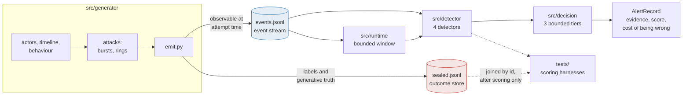

# Architecture

How the system is put together. Findings and numbers are in the
[README](../README.md); this answers the other question, which is whether the
code behind them is real and how it is arranged.

> **Generated file. Do not edit this file.** Edit
> `docs/architecture.template.md` and re-render with
> `python -m pipeline.cite --render-all`. Edits made here are overwritten without
> warning by the next render.
>
> Figures come from `results/results.json`.
> `python -m pipeline.cite --check` reports any generated file that no longer
> matches its template.

## The data path



Actors are drawn first with persistent attributes, they behave, and rows are the
consequence. The label is never an input to field generation: nothing in a row is
filled in because it is fraud.

`emit.py` writes two files and they are not the same file. `events.jsonl` holds
only what is knowable at the instant the attempt hits the gateway. `sealed.jsonl`
holds the labels, the burst and ring identity, and the generative truth. The
detector's loader is given the event stream path and has no code path to the
outcome file. The two are joined by `id` after scoring, never before.

That split is the thing that makes "we did not plant the signal" checkable rather
than asserted. Everything else in this document is downstream of it.

## The four detectors

All of them read the event stream and nothing else. Thresholds arrive as
arguments, because choosing a threshold needs labels and that is the harness's
job, not the detector's.

**Rolling volume** (`baselines.py`). Attempts per minute in a trailing window.
Reads timestamps. Ignores everything else, including whether the attempt
succeeded.

**Rolling decline** (`baselines.py`). Trailing decline rate, zero until the
window holds enough events to mean anything. Reads `status` and timestamps.
Without the floor, one failed attempt at 03:00 reads as a 100 percent decline
rate.

**Combined** (`baselines.py`). The weaker of the two normalised signals, so a
burst has to be both busy and failing. Taking the minimum rather than a product
keeps the score on a scale where 1.0 means both references were met. This is a
rule teams deploy, and under evasion it is the worst of the four, for the reason
in the README.

**Graph, fanout against overlap** (`graph.py`). The one the findings are about.
A card testing burst is a high-fanout, low-overlap structure: many throwaway
identities converging on very few instruments and devices. So the detector
measures neither concentration nor spread on its own, but the **disagreement
between two kinds of concentration in the same window**. Instruments and devices
converge, `iin` and `device_id`, while identities do not, `email`, `contact` and
`card.last4`. Each converging attribute's concentration is credited only to the
extent that identities in the same window are not concentrated.

Either half alone is ambiguous. High device concentration is one customer
retrying. High identity fanout is a busy minute, which is exactly what a flash
sale looks like. Their conjunction is the burst. Concentration is a Herfindahl
index, sum of squared shares, which is scale free, so a window of twelve events
and a window of nine hundred sit on the same footing and no volume threshold is
smuggled in. It reads no outcome field at all, which is why its scores are
identical across every evasive grade.

**Ring** (`ring.py`) is scored per account rather than per event, because a ring
is a group of accounts and one ring row in isolation is an ordinary purchase. Two
stages: connected components of "shares a pincode and shares a device", then
propagation from an implicated pincode to the other accounts on it, gated on that
pincode serving more accounts than a household contains.

## The decision layer

`src/decision/cost.py` converts a confusion matrix to rupees. Every parameter
carries one of three tags and there are no others: cited, measured from our own
stream, or an assumption we chose with the reasoning attached.

`src/decision/policy.py` turns a score into an action. Three tiers: monitor, step
up authentication, hold for review. All reversible. **There is no `DECLINE`
action in the code**, so no irreversible action exists rather than merely being
discouraged.

The tier boundaries are solved, not chosen. Expected cost at fraud probability p
is `p * cost_on_attack + (1 - p) * cost_on_legitimate`, a straight line in p for
each action, so the boundaries sit where two lines cross and `tier_boundaries()`
scans for the crossings. They move with the cost parameters and with the order
value: on a small enough order, occupying a reviewer never pays, and the record
says so. Every decision returns an `AlertRecord` carrying the evidence, the
score, the threshold crossed, the calibrated probability and the cost of being
wrong in each direction. There is no code path that acts without producing one.

## The streaming runtime

`src/runtime/stream.py` reads events in time order and holds one deque sized to
the largest window any detector needs. Old events are evicted and their
contribution leaves with them, so state tracks the event rate rather than the
stream length.

Equivalence with the batch path is structural rather than approximate, and that
is a deliberate design choice. The scoring functions in `src/detector/` are
already sliding-window and locate their window with `bisect_left(ts, t -
window_s)`. The runtime keeps exactly the events satisfying that condition and
calls the same function on the deque, taking the last element. The window the
function sees is identical in both paths, so the streaming score is not an
approximation of the batch score, it is the same arithmetic on the same inputs.
Measured: {{streaming.equivalence."GRAPH: fanout vs overlap".mismatches}} mismatches across
{{streaming.equivalence."GRAPH: fanout vs overlap".events|,}} events on all four detectors, maximum absolute
difference {{streaming.equivalence."GRAPH: fanout vs overlap".max_abs_diff|g}}, and
{{streaming.alerts.batch|,}} alerts in identical order.

The cost is O(window) per event rather than O(1) amortised, because the window is
rescanned instead of updated incrementally. That is the trade: an incremental
version would be a second implementation of every detector, and every counter in
it a place the two paths could drift apart.

One boundary detail matters and is easy to get wrong. Eviction is `ts < cutoff`,
strictly less than, because `bisect_left` includes an event sitting exactly on the
window boundary. Evicting on `<=` would drop one event on exact timestamp ties and
produce a rare divergence that looks like a rounding difference and is not.

## Isolation, and how it is enforced

These are the guarantees the numbers rest on. Each is checked by code rather than
by convention.

- **No module under `src/` imports from `tests/`.** Asserted by
  `tests/acceptance/isolation.py`, which walks the tree and greps imports.
- **No inference module mentions the outcome store.** The same check, scoped to
  `src/detector/`, `src/decision/` and `src/runtime/`. It is a blunt substring
  match on purpose: it once flagged a file whose docstring said it does *not*
  read that store, and the fix was to reword the prose, not to teach the check
  about negation.
- **`tests/fixtures.py` is the only path to the sealed store.** Nothing under
  `src/` may import it.
- **The structure oracle may read labels at configuration time and never at
  inference time.** It lives in `tests/oracle/` and its scores are reported as a
  ceiling, never as detector performance.
- **Thresholds are chosen on a train split; the test split is scored once.**
  Where a split has been scored twice, the output says so.

Before any detector runs, eight acceptance tests check the generator at six
attack grades. Their job is to fail if the data has been made too easy, and two
of them do fail and ship failing. The full statement is in
[generator-spec.md](generator-spec.md), section 5.

## The pipeline

One entry point regenerates every number from seed:

```
python -m pipeline.evaluate
```

It generates the datasets, runs the acceptance tests at every grade, all four
detectors, the ring detector, the cost model and the streaming check, then writes
`results/results.json`, a readable summary, and the chart. Stage output is
archived under `results/logs/`, and `--stage NAME` re-runs one stage so a single
failure does not cost a whole run.

Two properties are enforced rather than hoped for. **Determinism**: two runs
produce a byte-identical `results.json`, checked by `--verify`. Wall time and
timings live in `run_meta.json` instead, alongside the git commit, the seeds and
the package versions, because mixing a stopwatch reading into the numbers file
would make byte-identity impossible to check. **Traceability**: `pipeline/cite.py`
renders a document written with double-brace placeholders, each naming a key in
the artifact, and raises on an unknown one, so a figure absent from `results.json`
cannot appear
in a document. The README and this file are both generated that way.

Parsers are strict. If a table moves or a heading is renamed the pipeline stops,
because a silent mis-parse would put a wrong number into the artifact and from
there into a document, which is the failure this whole arrangement exists to
prevent.
