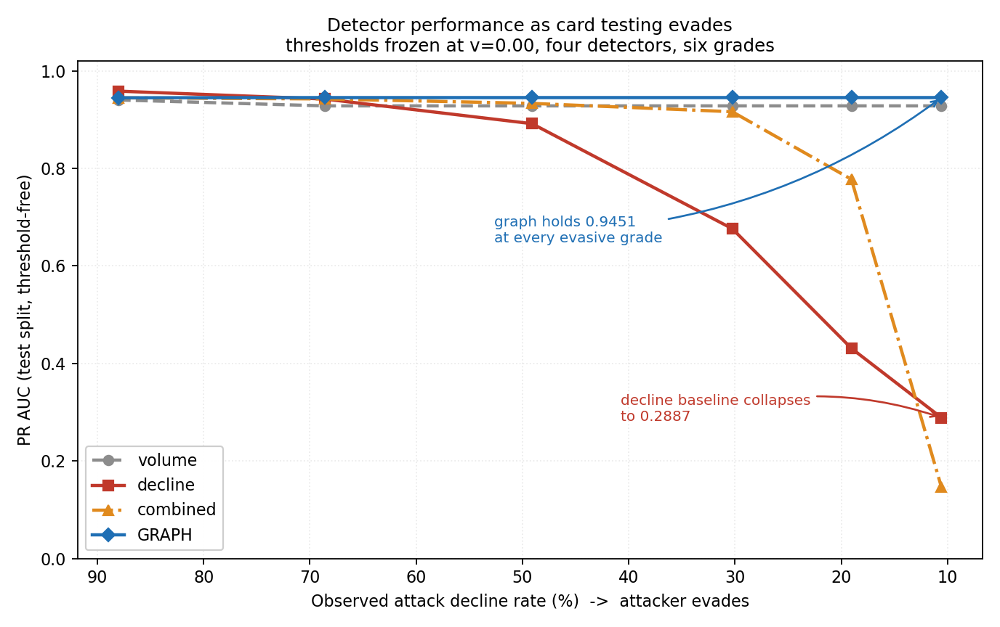

# Results

Generated by `python -m pipeline.evaluate`. Every number here comes from
`results.json`. Nothing in this file is typed by hand.

- commit `946edbbe3176` (working tree dirty)
- seed 42, 30 days, 40,000 actors
- python 3.13.5, matplotlib 3.10.0, numpy 2.1.3, scikit-learn 1.6.1, scipy 1.15.3
- results.json sha256 `a99decec1e636f9a`
- wall time 112.3 min

## The central result: PR AUC against observed decline rate

| detector | 88.0% | 68.6% | 49.1% | 30.3% | 19.1% | 10.6% |
|---|---|---|---|---|---|---|
| baseline 1: rolling volume | 0.9402 | 0.9281 | 0.9281 | 0.9281 | 0.9281 | 0.9281 |
| baseline 2: rolling decline | 0.9583 | 0.9421 | 0.8916 | 0.6763 | 0.4309 | 0.2887 |
| baseline 3: combined | 0.9446 | 0.9423 | 0.9332 | 0.9161 | 0.7775 | 0.1464 |
| GRAPH: fanout vs overlap | 0.9447 | 0.9451 | 0.9451 | 0.9451 | 0.9451 | 0.9451 |

### Recall

| detector | v=0.00 | v=0.25 | v=0.50 | v=0.75 | v=0.90 | v=1.00 |
|---|---|---|---|---|---|---|
| baseline 1: rolling volume | 0.8723 | 0.8791 | 0.8791 | 0.8791 | 0.8791 | 0.8791 |
| baseline 2: rolling decline | 0.9944 | 0.4847 | 0.0119 | 0.0000 | 0.0000 | 0.0000 |
| baseline 3: combined | 0.9803 | 0.9801 | 0.9801 | 0.7707 | 0.0000 | 0.0000 |
| GRAPH: fanout vs overlap | 0.9933 | 0.9921 | 0.9921 | 0.9921 | 0.9921 | 0.9921 |

### Bursts missed entirely (of 2 in the test split)

| detector | v=0.00 | v=0.25 | v=0.50 | v=0.75 | v=0.90 | v=1.00 |
|---|---|---|---|---|---|---|
| baseline 1: rolling volume | 0 | 0 | 0 | 0 | 0 | 0 |
| baseline 2: rolling decline | 0 | 0 | 0 | 2 | 2 | 2 |
| baseline 3: combined | 0 | 0 | 0 | 0 | 2 | 2 |
| GRAPH: fanout vs overlap | 0 | 0 | 0 | 0 | 0 | 0 |

## Cost: the price of not adapting

Excess rupees from freezing the threshold at the v=0.00 money optimum.

| detector | v=0.00 | v=0.25 | v=0.50 | v=0.75 | v=0.90 | v=1.00 |
|---|---|---|---|---|---|---|
| baseline 1: rolling volume | 0 | 11,382 | 23,500 | 32,319 | 36,213 | 40,696 |
| baseline 2: rolling decline | 0 | 54,918 | 1,021,363 | 1,751,607 | 2,032,544 | 1,915,447 |
| baseline 3: combined | 0 | 1,113 | 977 | 46,502 | 1,633,382 | 2,123,214 |
| GRAPH: fanout vs overlap | 0 | 920 | 1,256 | 1,705 | 2,186 | 2,548 |

| detector | F1 threshold | money threshold | gap (Rs) | gap % |
|---|---|---|---|---|
| baseline 1: rolling volume | 24.3333 | 11.6667 | 27,644 | 27.18% |
| baseline 2: rolling decline | 0.6250 | 0.5000 | 889 | 1.43% |
| baseline 3: combined | 0.3288 | 0.2667 | 1,134 | 1.69% |
| GRAPH: fanout vs overlap | 0.4741 | 0.3874 | 919 | 1.46% |

## Streaming against batch

Reproduces batch exactly: **True**. Alerts batch 3890, stream 3890, identical True.

| detector | events | mismatches | max abs diff |
|---|---|---|---|
| baseline 1: rolling volume | 67,961 | 0 | 0 |
| baseline 2: rolling decline | 67,961 | 0 | 0 |
| baseline 3: combined | 67,961 | 0 | 0 |
| GRAPH: fanout vs overlap | 67,961 | 0 | 0 |

Throughput 553 events/sec, 1.808 ms per event. Measured, not reproducible: it moves with machine load, which is why it is recorded in `run_meta.json` and not here.

| events | peak KiB | max window events |
|---|---|---|
| 2,000 | 243.8 | 67 |
| 8,000 | 576.4 | 67 |
| 20,000 | 576.4 | 67 |
| 40,000 | 954.4 | 160 |
| 67,961 | 949.3 | 160 |

## Acceptance tests

| test | v=0.00 | v=0.25 | v=0.50 | v=0.75 | v=0.90 | v=1.00 |
|---|---|---|---|---|---|---|
| T1 single-feature ceiling | FAIL | FAIL | FAIL | FAIL | FAIL | FAIL |
| T2 label shuffle | PASS | PASS | PASS | PASS | PASS | PASS |
| T3 benign collisions | PASS | PASS | PASS | PASS | PASS | PASS |
| T4 ordering and identity | PASS | PASS | PASS | PASS | PASS | PASS |
| T5 string and metadata hygiene | PASS | PASS | PASS | PASS | PASS | PASS |
| T6 confounder survival | PASS | PASS | PASS | PASS | PASS | PASS |
| T7 determinism | PASS | PASS | PASS | PASS | PASS | PASS |
| T8 oracle isolation | PASS | PASS | PASS | PASS | PASS | PASS |
| T8 signal floor (oracle ceiling) | FAIL | FAIL | FAIL | FAIL | FAIL | FAIL |

## Ring detector, patched population

| detector | precision | recall | PR AUC |
|---|---|---|---|
| pincode baseline (peers on pincode) | 0.0037 | 0.9444 | 0.0036 |
| stage 1 only: conjunction | 0.0000 | 0.0000 | 0.2318 |
| RING DETECTOR: conj + drop addr | 0.0000 | 0.0000 | 0.5820 |
